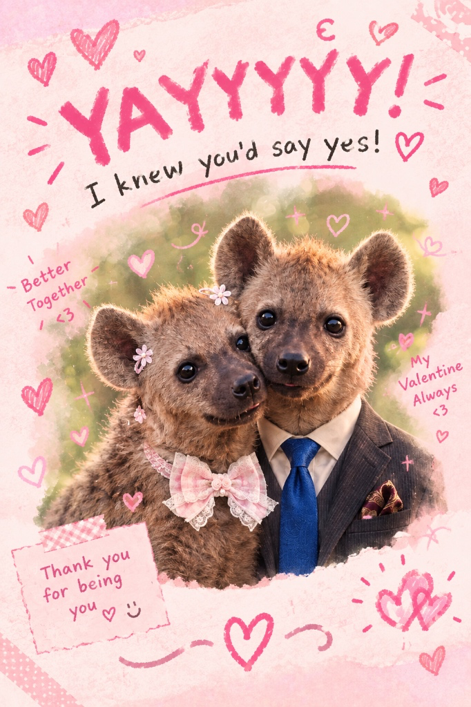

<!DOCTYPE html>
<html lang="zh-TW">
<head>
  <meta charset="UTF-8" />
  <meta name="viewport" content="width=device-width, initial-scale=1.0" />
  <title>Will you be my valentine? 💕</title>
  
</head>
<body>

  

    <!-- 主詢問區塊 -->
    

      <h1 id="questionText">Will you be my valentine? 💕</h1>
      
(There is only one correct answer.)

      

        
      

      

        <button class="btn-yes" onclick="acceptProposal()">YES 💗</button>
        <button class="btn-no" id="noBtn" onmouseover="handleNoInteraction()" onclick="handleNoInteraction()" ontouchstart="handleNoInteraction()">NO 😈</button>
      

    

    <!-- 成功區塊 -->
    

      

        
      

    

  

  
</body>
</html>
